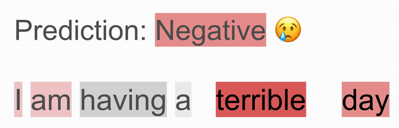

# Text Counterfactuals

This folder contains files for creating and deploying a docker-based
lambda function that uses two external endpoints to generate text
counterfactuals.

## How it Works
To generate text counterfactuals, this function requires two external
endpoints: an XAI enabled text classification endpoint and a masked
language modelling endpoint. The function accepts the following
arguments:

 - `input_text` `(str)`: The starting text which will have
   counterfactuals generated based on it.

 - `classification_model` `(str)`: The name of the classification
   sagemaker endpoint being used to generate explanations.

 - `masked_language_model` `(str)`: The name of the masked language
   model sagemaker endpoint that will be used to unmask important
   tokens.

 - `desired_class` `(str)`: The name of the desired class. The input
   text will be "steered" towards this class during the
   counterfactual generation process.

 - `undesired_class` `(str)`: The name of the undesired class. This
   tells the function which tokens to mask.

 - `unmasking_token_types` `(List(str))`: A list of strings where each
   string is a tag from SpaCy's part-of-speech tagging. Tags in this
   list will be marked as acceptable to mask and replace.

Text counterfactuals are generated by following these steps:

1. The input text is sent to the text classification endpoint where a
   prediction and an explanation are generated.

2. If the text is in the `undesired_class`, each token will be tagged
   using SpaCy's part-of-speech tagging and tags in the
   `unmasking_token_types` list will be marked as acceptable for
   unmasking. This is done to maintain the meaning of the input text.
   In special cases, tokens that are not in `unmasking_token_types`
   will be marked as acceptable for unmasking if they significantly
   contribute to the prediction of `undesired_class`.

3. The explanation is sent to a function that masks the tokens that
   most constributed to the prediction of `undesired_class`.

4. The (now masked) input text is sent to a function that unmasks each
   mask in the text. The tokens are unmasked one at a time from left to
   right, and only the predicted tokens that move the input text most
   towards the `desired_class` are kept. This process is repeated until
   all masked tokens are unmasked. Once all masked tokens are unmasked,
   the various counterfactuals are returned.